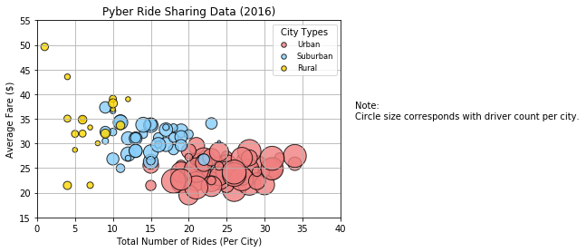
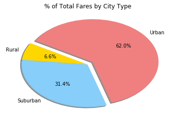
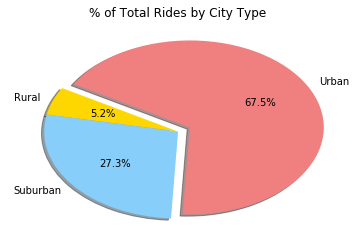
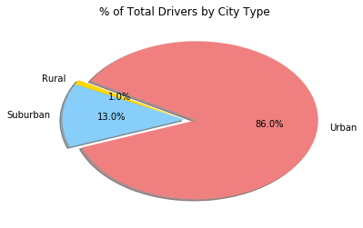

```python
import pandas as pd
import numpy as np
import matplotlib.pyplot as plt

ride_csv = 'raw_data/ride_data.csv'
city_csv = 'raw_data/city_data.csv'

ride_data = pd.read_csv(ride_csv)
city_data = pd.read_csv(city_csv)

all_data = pd.merge(ride_data, city_data, how = 'left', on=['city','city'])
# all_data.head(1)
```

###  Setup Bubble Plot Data


```python
# get X and Y data for each bubble plot
urban_rides = all_data[all_data["type"] =='Urban']
suburban_rides = all_data[all_data["type"] =='Suburban']
rural_rides = all_data[all_data["type"] =='Rural']

urban_avg = urban_rides.groupby(["city"]).mean()["fare"]
urban_count = urban_rides.groupby(["city"]).count()["ride_id"]
urban_drivers = urban_rides.groupby(["city"]).mean()["driver_count"]

suburban_avg = suburban_rides.groupby(["city"]).mean()["fare"]
suburban_count = suburban_rides.groupby(["city"]).count()["ride_id"]
suburban_drivers = suburban_rides.groupby(["city"]).mean()["driver_count"]

rural_avg = rural_rides.groupby(["city"]).mean()["fare"]
rural_count = rural_rides.groupby(["city"]).count()["ride_id"]
rural_drivers = rural_rides.groupby(["city"]).mean()["driver_count"]
```


```python
plt.scatter(urban_count, urban_avg, 
            s=10*urban_drivers, c="lightcoral", 
            edgecolor="black", linewidths=1, marker="o", 
            alpha=0.8, label="Urban")
plt.scatter(suburban_count, suburban_avg, 
            s=10*suburban_drivers, c="lightskyblue", 
            edgecolor="black", linewidths=1, marker="o", 
            alpha=0.8, label="Suburban")
plt.scatter(rural_count, rural_avg, 
            s=10*rural_drivers, c="gold", 
            edgecolor="black", linewidths=1, marker="o", 
            alpha=0.8, label="Rural")

# Incorporate the other graph properties
plt.title("Pyber Ride Sharing Data (2016)")
plt.ylabel("Average Fare ($)")
plt.xlabel("Total Number of Rides (Per City)")
plt.ylim((15,55))
plt.xlim((0,40))
plt.grid(True)

# Create a legend
lgnd = plt.legend(fontsize="small", mode="Expanded", 
                  numpoints=1, scatterpoints=1, 
                  loc="best", title="City Types", 
                  labelspacing=0.5)

lgnd.legendHandles[0]._sizes = [30]
lgnd.legendHandles[1]._sizes = [30]
lgnd.legendHandles[2]._sizes = [30]

# Incorporate a text label regarding circle size
plt.text(42, 35, "Note:\nCircle size corresponds with driver count per city.")

plt.show()
```





###  Setup Pie Charts


```python
type_pcts = 100 * all_data.groupby(["type"]).sum()["fare"] / all_data["fare"].sum()
# type_pcts

ride_pcts = 100 * all_data.groupby(["type"]).count()["ride_id"] / all_data["ride_id"].count()
# ride_pcts

driver_pcts = 100 * all_data.groupby(["type"]).sum()["driver_count"] / all_data["driver_count"].count()
# driver_pcts
```


```python
plt.pie(type_pcts,
       labels = ["Rural", "Suburban", "Urban"],
       colors = ["gold", "lightskyblue", "lightcoral"],
       explode =[0, 0, 0.1],
       autopct = "%1.1f%%",
       shadow =  True,
       startangle = 150
       )
plt.title("% of Total Fares by City Type")

plt.savefig('analysis/fig2.png')
plt.show()
```





###  Total Rides by City Type Pie Chart


```python
plt.pie(ride_pcts,
       labels = ["Rural", "Suburban", "Urban"],
       colors = ["gold", "lightskyblue", "lightcoral"],
       explode =[0, 0, 0.1],
       autopct = "%1.1f%%",
       shadow =  True,
       startangle = 150
       )
plt.title("% of Total Rides by City Type")

plt.savefig('analysis/fig3.png')
plt.show()
```





```python
### Total Drivers by City Type Pie Chart
```


```python
plt.pie(driver_pcts,
       labels = ["Rural", "Suburban", "Urban"],
       colors = ["gold", "lightskyblue", "lightcoral"],
       explode =[0, 0, 0.1],
       autopct = "%1.1f%%",
       shadow =  True,
       startangle = 150
       )
plt.title("% of Total Drivers by City Type")

plt.savefig('analysis/fig4.png')
plt.show()
```





###  Written Analysis
-  Ridesharing was busiest in cities with an urban population and generally had the lowest fares
-  Per driver, the highest fares were garnered through suburban operations
-  Rural operations had the greatest variance in rates per drive while having the lowest number of drivers.
